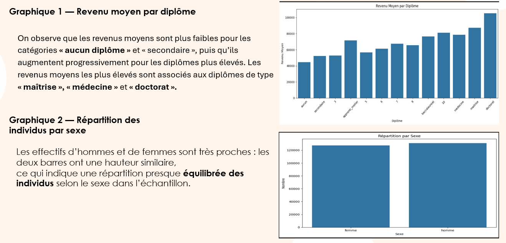

# 📊 Revenus et Niveau de Diplôme au Canada (Recensement 2021)

Analyse des revenus moyens au Canada en fonction du **niveau de diplôme**, à partir des données officielles du **Recensement canadien 2021 (Statistique Canada)**.

🔗 Source des données :  
https://www12.statcan.gc.ca/census-recensement/2021/dp-pd/index-fra.cfm

---

## 🎯 Objectifs du projet

- Étudier l’impact du **niveau de diplôme** sur le **revenu**
- Identifier les variables les plus influentes (diplôme, sexe, province, domaine d’étude, âge)
- Produire des **visualisations claires et interprétables**
- Construire un **modèle de régression** pour expliquer les écarts de revenus

---

## 🧠 Données utilisées

- **Source** : Statistique Canada — Recensement 2021  
- **Population** : Adultes actifs au Canada  
- **Variables principales** :
  - Niveau de diplôme
  - Revenu
  - Sexe
  - Province
  - Domaine d’étude
  - Âge
  - Industrie

---

## 📈 Analyses exploratoires (EDA)

### 🔹 Revenu moyen par niveau de diplôme

On observe une **augmentation progressive du revenu moyen** avec le niveau de diplôme.  
Les revenus les plus élevés sont associés aux diplômes de type :

- 🎓 Maîtrise  
- 🎓 Médecine  
- 🎓 Doctorat  

📌 Les catégories *« aucun diplôme »* et *« secondaire »* présentent les revenus moyens les plus faibles.

---

### 🔹 Répartition des individus par sexe

La répartition entre **hommes** et **femmes** est **presque équilibrée**, ce qui limite les biais liés au genre dans l’analyse globale.

---

## 📊 Modélisation — Régression

Un modèle de **régression log-salaire** a été utilisé afin d’identifier l’importance moyenne de chaque variable.

### 🔎 Importance des variables dans le modèle

- **Diplôme** : facteur dominant (impact très élevé)
- **Industrie** et **domaine d’étude** : influence notable
- **Sexe** et **province** : effets modérés
- **Âge** : impact plus faible

👉 Le **niveau de diplôme** reste le facteur le plus déterminant du revenu.

---

## 🛠️ Outils et technologies

- **Python** (pandas, numpy, matplotlib, seaborn)
- **Analyse statistique & régression**
- **Visualisation de données**
- **Git & GitHub**

---

## 📌 Résultats clés

- Le diplôme est le **meilleur prédicteur du revenu**
- Les diplômes avancés offrent un avantage salarial significatif
- Les écarts liés au sexe existent mais restent secondaires face au diplôme
- Les différences provinciales ont un effet mesurable mais limité

---

## 👤 Auteur

**Lounes Djayet**  
🎓 Data Scientist — Étudiant en Sciences des Données Appliquées  
🏫 Collège La Cité (Ottawa / Gatineau)  

🔗 Portfolio : https://lounesdjl04.github.io/  
🔗 GitHub : https://github.com/Lounesdjl04  
🔗 LinkedIn : https://www.linkedin.com/in/lounes-djayet-a0b046367/

---

## ⚖️ Licence

Données : © Statistique Canada (Recensement 2021)  
Projet académique — usage éducatif
